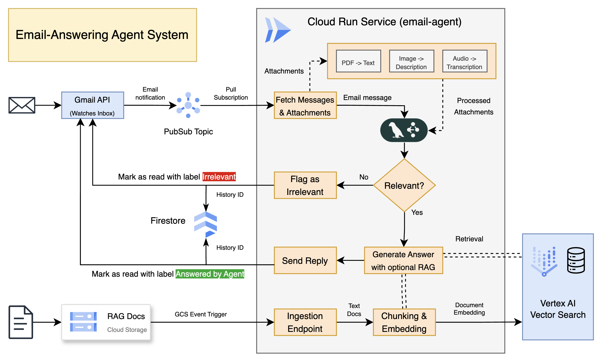
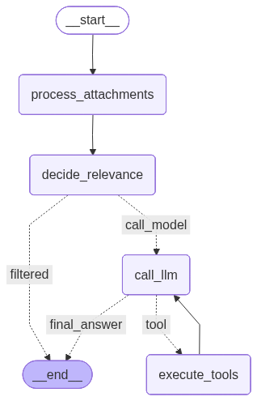

# Email-Answering Agent System

### Application

This project implements a `LangGraph` agent, that reacts to `Gmail API` triggers for a configured user's inbox and generates answers to received emails. The current implementation includes prompts set up for an agent that answers customer questions about products.

The agent considers the email headers, body and attachments. Following is a list of allowed attachment types and their respective preprocessing method:
- PDFs - text extracted using `PyPDF2`
- Images - `Gemini` LLM used to generate a textual description of key elements within the image
- Audio - the `Speech-to-Text` API from Google is used to transcribe the audio files to text form

After processing the received email message, the agent executor uses a conditional node to decide whether or not the email content is relevant to the business case. If not, the email thread is marked with the label *"Irrelevant"* and not answered.
For emails deemed as relevant, an automatic reply is generated and sent and the thread is labeled with *"Answered by Agent"*.

During the LLM call for response generation, the agent may decide to use a retrieval tool and access documents stored in a Vector Store index. The ingestion pipeline for these documents consists of an event trigger set up on a specific `Google Cloud Storage` bucket, which reacts to uploaded text files, which are then chunked, embedded and upserted into the index.

  

In order to keep track of processed emails, the `historyId` of an inbox status is stored in a `Firestore` document. Currently, the agent does not support multi-turn conversation, but the individual conversation turns will also be stored here once the functionality is implemented.

The `watch()` command that instructs the `Gmail API` to monitor a specific inbox needs to be periodically refreshed. For that reason, the system includes a dedicated endpoint that renews this command and a `Google Cloud Scheduler` job is triggered each day to call this endpoint.

### Infrastructure

The complete infrastructure is deployed on `Google Cloud` and managed via a `Terraform` configuration, which is located under `/iac`.